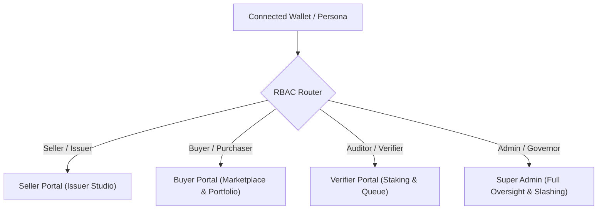

# Carbonyx Protocol — Remaining Tasks & Implementation Roadmap

> **Target Milestone:** HackOut'26 — Phase C3, C4 & C5 Completion  
> **Repository:** Carbonyx Monorepo (`contracts/`, `backend/`, `ml-engine/`, `frontend/`, `supabase/`)  
> **Reference Specifications:** [Specs/12_ROADMAP.md](Specs/12_ROADMAP.md) • [Specs/07_TECHNICAL_ARCHITECTURE.md](Specs/07_TECHNICAL_ARCHITECTURE.md)

---

## 📊 Current Monorepo Status Summary

| Layer | Status | Completed Highlights | Remaining Key Deliverables |
| :--- | :---: | :--- | :--- |
| **Smart Contracts** | 85% | `CarbonRegistry`, `CarbonCreditNFT`, `VerifierStakingLedger`, `EscrowSettlement` (9/9 forge tests passing) | Complete 3-way hook in `resolveDispute()`: revoke credit + 100% buyer escrow refund + 50% verifier stake slashing |
| **ML Engine** | 95% | Trained Isolation Forest artifact (`anomaly_model.pkl`), correlation checker, XAI reasoner, verifier matcher | Minor telemetry edge cases in automated testing |
| **Backend Relayer** | 75% | DIDs, Merkle tree computation, Sentinel-2 NDVI satellite service, policy-gated minting | Verifier audit endpoints, Escrow buy/refund endpoints, Dispute resolution routes, Realtime event listener, RBAC middleware |
| **Frontend UI/UX** | 80% | Institutional Home Page, complete Issuer Studio with scenario tuner & live Copernicus fetch | 4-Role RBAC Switcher & Route Guards, Escrow Buy Modal, Verifier review action wire-up, Live Slashing Log |

---

## 🔐 Priority 1: Role-Based Access Control (RBAC) System

Implement a multi-persona permission model dividing protocol users into **4 distinct roles**:

### 1.1 The 4 Protocol Roles Specification

| Role | Target Persona | Primary Permissions & Capabilities | Accessible UI Pages / Tabs |
| :--- | :--- | :--- | :--- |
| **1. Seller / Issuer** (`ISSUER`) | Carbon Project Developers & Conservation Orgs | • Register green projects & generate W3C `did:carbonyx` identity • Ingest physical IoT sensor, Sentinel-2 satellite & operational MRV telemetry • Trigger AI anomaly risk scoring • Mint dynamic ERC-721 carbon credit tokens upon policy approval | • Protocol Overview • **Issuer Studio** • My Projects & Minted Badges |
| **2. Buyer / Purchaser** (`BUYER`) | Institutional Buyers, Corporations & ESG Funds | • Browse verified, Merkle-backed carbon credit listings • Deposit payment into custodial escrow with challenge window protection (`buyWithEscrow`) • Manage held dynamic NFT certificates in Buyer Portfolio • Irreversibly burn & retire credits for verified on-chain offset certificates | • Protocol Overview • **Offset Marketplace** • **Buyer Portfolio & Holdings** • Retirement Certificate Modal |
| **3. Verifier / Auditor** (`VERIFIER`) | Accredited Carbon Verifiers (e.g. Verra / Gold Standard) | • Deposit & maintain minimum $0.1\text{ ETH}$ collateral stake in `VerifierStakingLedger` • Access Anomaly Queue for low-confidence evidence bundles ($<85\%$ score) • Inspect side-by-side telemetry divergence (IoT vs. Satellite NDVI) • Submit cryptographic audit approval or fraud rejection on-chain | • Protocol Overview • **Verifier Portal** • Staking Profile & Anomaly Queue |
| **4. Admin / Governor** (`ADMIN`) | Carbonyx Protocol Foundation & DAO Stewards | • **Full omniscient oversight:** Can view, inspect, and test all 4 portals • Adjudicate and resolve community disputes (`resolveDispute`) • Trigger automated **50% verifier stake slashing** on upheld fraud • Monitor smart contract addresses, Merkle integrity, and system health | • **All Navigation Tabs (Unrestricted)** • **Auditor Explorer & Slashing Console** • Dispute Resolution Adjudication |

### 1.2 Frontend Implementation (`frontend/src/App.tsx`)
- [ ] **Interactive Role Switcher Pill in Header**:
  - Add a persona selector dropdown/pill in the navigation bar (`[👤 Seller | 🛒 Buyer | 🛡️ Verifier | 👑 Admin]`).
  - Auto-detect role from wallet address or allow manual switching for demo/testing purposes.
  - Dynamically filter visible navigation tabs based on active role (Admin sees all 5 tabs; Seller sees Overview + Issuer; Buyer sees Overview + Marketplace + Portfolio; Verifier sees Overview + Verifier Portal).
- [ ] **Route & View Guards**:
  - Prevent non-verifiers from submitting audits.
  - Prevent non-issuers from submitting project telemetry.
  - Allow Admin bypass to test and demonstrate every workflow seamlessly.

### 1.3 Backend & Supabase Security
- [ ] Add `role` column to `users` / `projects` table (or map via wallet address).
- [ ] Enforce role checks on sensitive endpoints:
  - Only `VERIFIER` or `ADMIN` can call `POST /api/verifiers/audit`.
  - Only `ADMIN` can call `POST /api/disputes/resolve`.
  - Only `ISSUER` or `ADMIN` can call `POST /api/credits/mint`.

---

## 🚀 Priority 2: Verifier Staking & Audit Decisions (Phase C3)

Currently, the Verifier Portal displays profile metrics and the Anomaly Queue, but buttons use mock browser alerts.

### 2.1 Backend: Verifier Operations (`backend/src/routes/verifiers.routes.ts`)
- [ ] **Implement `POST /api/verifiers/stake`**:
  - Accept `verifierAddress` and `amountEth`.
  - Trigger `VerifierStakingLedger.stake()` via Relayer or Web3.
  - Update `verifier_stakes` in Supabase.
- [ ] **Implement `POST /api/verifiers/audit`**:
  - Accept `bundleId`, `verifierAddress`, `approved` (boolean), `auditNotes`.
  - Call `CarbonRegistry.recordVerification(bundleId, approved)` on-chain via Relayer.
  - Update `evidence_bundles` status (`VERIFIED_APPROVED` or `VERIFIED_REJECTED`) and `risk_assessments.verifier_required` in Supabase.
  - Call `VerifierStakingLedger.updateReputation(verifier, successfulAudit)` on-chain.

### 2.2 Frontend: Verifier Portal Wire-Up (`frontend/src/pages/VerifierPortal.tsx`)
- [ ] Connect **"Deposit +0.1 ETH Stake"** to MetaMask Web3 contract call or backend relayer.
- [ ] Connect **"Reject & Flag Fraud"** button to `POST /api/verifiers/audit` with `approved = false`.
- [ ] Add an **"Approve & Sign Audit"** button for low-risk queued bundles with `approved = true`.
- [ ] Refresh the Anomaly Queue in real-time when an item is reviewed.

---

## 🛒 Priority 3: Custodial Escrow Trading Flow (Phase C3)

Currently, users can only view marketplace credits and trigger retirement, with no mechanism to buy credits through on-chain escrow.

### 3.1 Backend: Escrow Endpoints (`backend/src/routes/marketplace.routes.ts`)
- [ ] **Implement `POST /api/marketplace/buy`**:
  - Accept `tokenId`, `buyerAddress`, `priceEth`.
  - Execute `EscrowSettlement.buyWithEscrow(tokenId)` with locked challenge period.
  - Update NFT record in `carbon_credit_nfts` (`status = 'ESCROWED'`).
  - Create record in `escrows` table in Supabase.
- [ ] **Implement `POST /api/marketplace/release`**:
  - Release funds to seller and transfer NFT to buyer after challenge window expires.
- [ ] **Upgrade `POST /api/marketplace/retire`**:
  - In addition to Supabase status update, invoke `CarbonCreditNFT.retireCredit(tokenId, reason)` on-chain via Relayer.

### 3.2 Frontend: Escrow Purchase Modal (`frontend/src/pages/Marketplace.tsx`)
- [ ] Add **`EscrowBuyModal.tsx`**:
  - Display credit details, tonnage, vintage, and escrow security notice (funds locked during challenge window).
  - Submit transaction to `POST /api/marketplace/buy` or direct Web3 wallet call.
- [ ] Add a **"Buyer Portfolio"** filter tab in Marketplace to separate unretired purchased credits from public catalog.

---

## ⚖️ Priority 4: Dispute Resolution & 50% Slashing Mechanism (Phase C4)

*This is the core patent differentiator and hackathon show-stopper.*

### 4.1 Smart Contract: 3-Way Dispute Settlement (`contracts/src/CarbonRegistry.sol`)
- [ ] Update `resolveDispute(uint256 tokenId, bool upholdDispute, string calldata resolutionDetails)`:
  - If `upholdDispute == true`:
    1. Permanently revoke credit: `carbonCreditNFT.setCreditStatus(tokenId, REVOKED)`.
    2. Refund buyer from escrow: `escrowSettlement.refundEscrow(escrowId)` (100% refund).
    3. Slash auditor collateral: `verifierStakingLedger.slashVerifier(approvingVerifier, 50)` (automated 50% stake slash).
  - Add unit test in `contracts/test/CarbonPipeline.t.sol` verifying the full dispute-slashing lifecycle.

### 4.2 Backend: Dispute Routes (`backend/src/routes/disputes.routes.ts`)
- [ ] Create `disputes.routes.ts` and mount at `/api/disputes`:
  - `POST /api/disputes/raise`: Accept `tokenId`, `initiatorAddress`, `reason`, `evidenceUrl`. Record dispute in Supabase and call `CarbonRegistry.disputeCredit(tokenId, reason)`.
  - `POST /api/disputes/resolve`: Admin endpoint calling `CarbonRegistry.resolveDispute(tokenId, uphold, details)` on-chain and syncing `disputes` + `verifier_stakes` tables.
  - `GET /api/disputes`: Fetch active and historical disputes.

### 4.3 Frontend: Auditor Explorer Enhancements (`frontend/src/pages/AuditorExplorer.tsx`)
- [ ] **Live Slashing & Dispute Audit Log**:
  - Render a live data table of slashing events (Dispute ID, Slashed Verifier, Amount ETH Slashed, Reason, Tx Hash).
- [ ] **Interactive Merkle Proof Validator**:
  - Form where an auditor pastes an evidence leaf/telemetry hash and verifies its cryptographic inclusion against the committed on-chain Merkle root.
- [ ] Add a "Raise Dispute" button on credits within the Explorer / Marketplace.

---

## 🔄 Priority 5: Blockchain Event Listener & Real-Time Sync

Keep off-chain PostgreSQL state synchronized with on-chain EVM transactions automatically.

### 5.1 Backend Service (`backend/src/services/eventListener.service.ts`)
- [ ] Create `eventListener.service.ts`:
  - Connect to RPC provider WebSocket or polling filter.
  - Listen for:
    - `CarbonRegistry.CreditIssued` $\rightarrow$ Insert/update `carbon_credit_nfts`.
    - `EscrowSettlement.EscrowCreated` $\rightarrow$ Insert `escrows`.
    - `EscrowSettlement.EscrowRefunded` $\rightarrow$ Update `escrows` & `carbon_credit_nfts`.
    - `VerifierStakingLedger.VerifierSlashed` $\rightarrow$ Update `verifier_stakes` and log event.
- [ ] Initialize listener in `backend/src/server.ts`.

---

## 🧪 Priority 6: End-to-End Master Script & Hackathon Demos (Phase C5)

### 6.1 Automated Multi-Phase Master Test Suite (`scripts/verify_phase_3.py`)
- [ ] Write Python integration test verifying:
  1. Project registration with DID generation (Seller flow).
  2. Telemetry ingestion & Merkle root generation.
  3. ML Anomaly scoring (Clean vs. Anomaly).
  4. Auto-minting of ERC-721 token.
  5. Escrow purchase locking (Buyer flow).
  6. Dispute raised $\rightarrow$ Dispute upheld $\rightarrow$ 50% verifier stake slashed & buyer refunded (Admin flow).

### 6.2 3-Minute Hackathon Demo Rehearsal Setup
- [ ] **Demo Track A (Clean Flow — 90 seconds)**:
  - Switch role to **Seller** $\rightarrow$ Register Amazonian Peatland $\rightarrow$ Load "Clean" scenario $\rightarrow$ 94% Confidence $\rightarrow$ Auto-mint NFT $\rightarrow$ Switch to **Buyer** $\rightarrow$ Purchase with Escrow $\rightarrow$ Execute instant retirement burn.
- [ ] **Demo Track B (Fraud Caught & Slashed — 90 seconds)**:
  - Load "Anomalous" scenario (NDVI -0.25 loss) $\rightarrow$ Confidence drops to 38% $\rightarrow$ Switch to **Verifier** $\rightarrow$ View side-by-side diff in Anomaly Queue $\rightarrow$ Compromised approval $\rightarrow$ Switch to **Admin** $\rightarrow$ Uphold Dispute $\rightarrow$ **Show 50% Stake Slashed live in Auditor Explorer**.

---

## 📋 Task Breakdown & File Reference Matrix

| Task Item | Target File | Component | Difficulty |
| :--- | :--- | :--- | :---: |
| 4-Role RBAC Header Switcher & Tab Filtering | `frontend/src/App.tsx` | Frontend | Low |
| Wire `resolveDispute()` to Staking & Escrow | `contracts/src/CarbonRegistry.sol` | Smart Contracts | Medium |
| Add Verifier Audit Endpoint | `backend/src/routes/verifiers.routes.ts` | Backend | Low |
| Add Escrow Buy & Release Endpoints | `backend/src/routes/marketplace.routes.ts` | Backend | Medium |
| Create Disputes REST Router | `backend/src/routes/disputes.routes.ts` | Backend | Medium |
| Add Relayer Dispute & Staking Methods | `backend/src/services/relayer.service.ts` | Backend | Low |
| Add `EscrowBuyModal` & Buyer Portfolio | `frontend/src/pages/Marketplace.tsx` | Frontend | Medium |
| Connect Verifier Portal Actions | `frontend/src/pages/VerifierPortal.tsx` | Frontend | Low |
| Add Slashing Log & Merkle Proof Validator | `frontend/src/pages/AuditorExplorer.tsx` | Frontend | Medium |
| Realtime Blockchain Event Listener | `backend/src/services/eventListener.service.ts` | Backend | Medium |
| Master E2E Verification Script | `scripts/verify_phase_3.py` | Testing | Medium |
